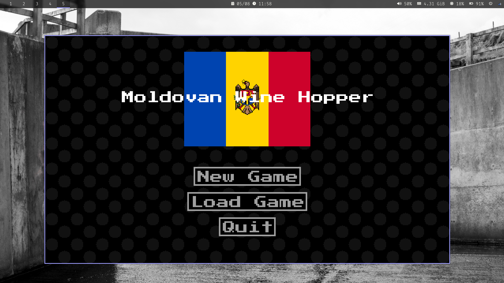
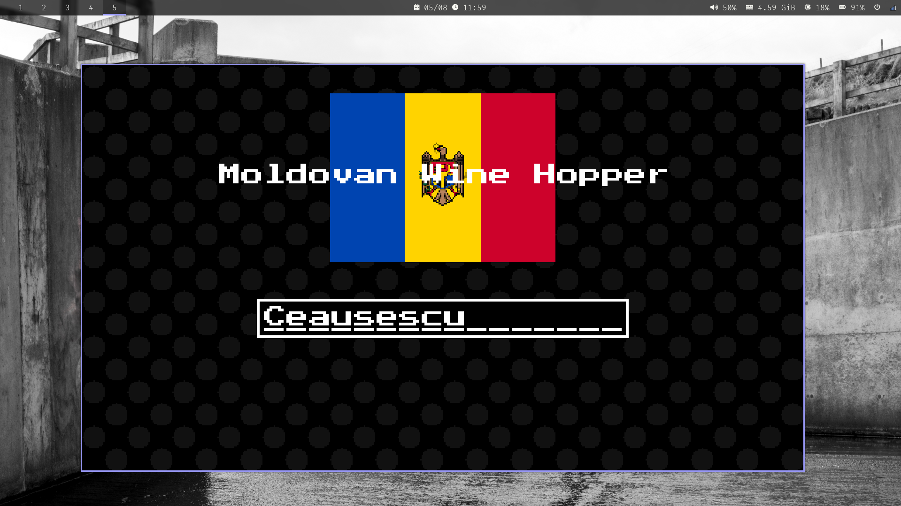
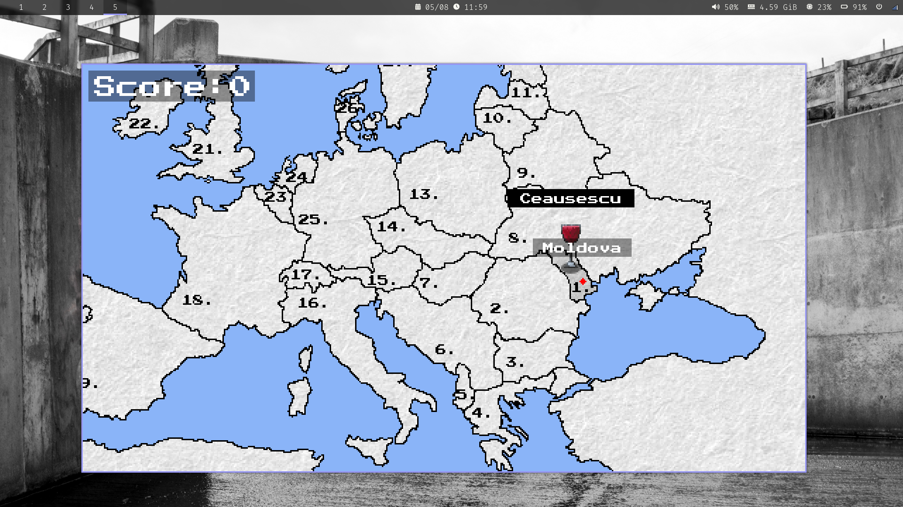
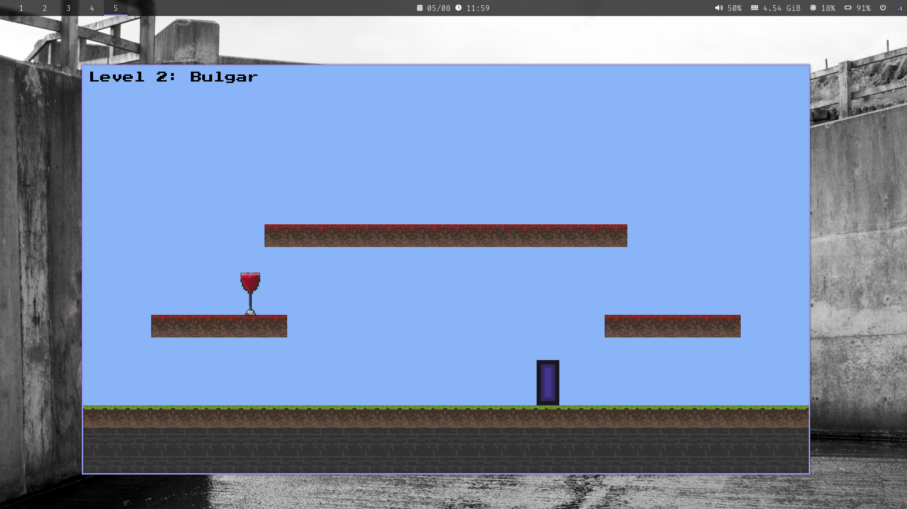
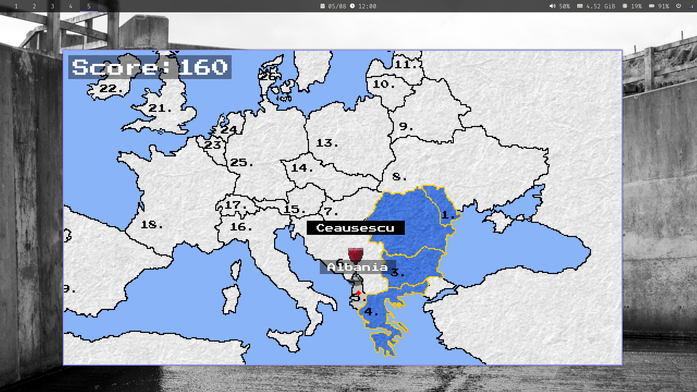
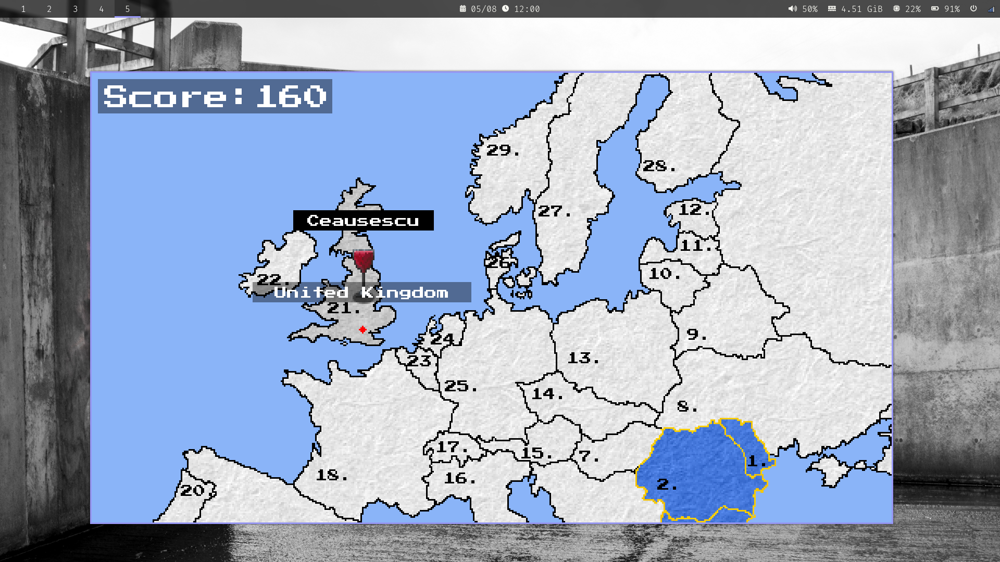

## Moldovan Wine Hopper (COMP2006 CW)

Small game made for university over a couple of days. Written from scratch with C++ with the SDL2 library (+ university provided wrapper framework, most of the code I wrote is building up an idiomatic & easily extensible engine).

Made by Eden Tyler-Moss `<psyet3@nottingham.ac.uk>`

### Building

Note: this project is tested on GNU+Linux only. Works with standard cmake configure + build.

### Screenshots

